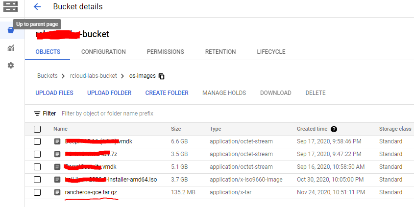
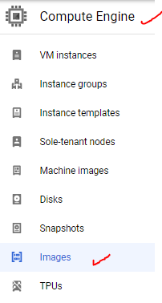
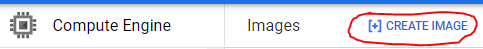
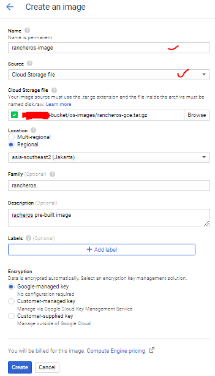

# How to Upload RancherOS Image to GCP

RancherOS is available as an image in GCE, and can be easily run in Google Compute Engine (GCE). Let’s walk through how to upload GCE image.

1. Download the most recent RancherOS image. The image can be found in the [release artifacts](https://github.com/rancher/os/releases). It is a .tar.gz file

2. Upload the .tar.gz image file to Cloud Storage bucket

3. Import the image to Compute Engine as a new custom image by clicked "Create Image" button in gcp images page

4. Fill the form with your own information or you can follow from the image below.

You need to make sure to pick the source from cloud storage then click "create" button

5. Use the imported image to create a VM instance and make sure it boots properly